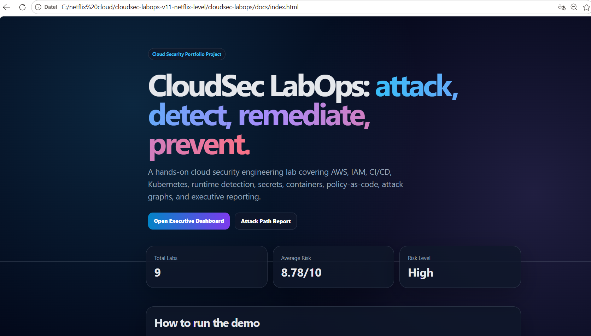
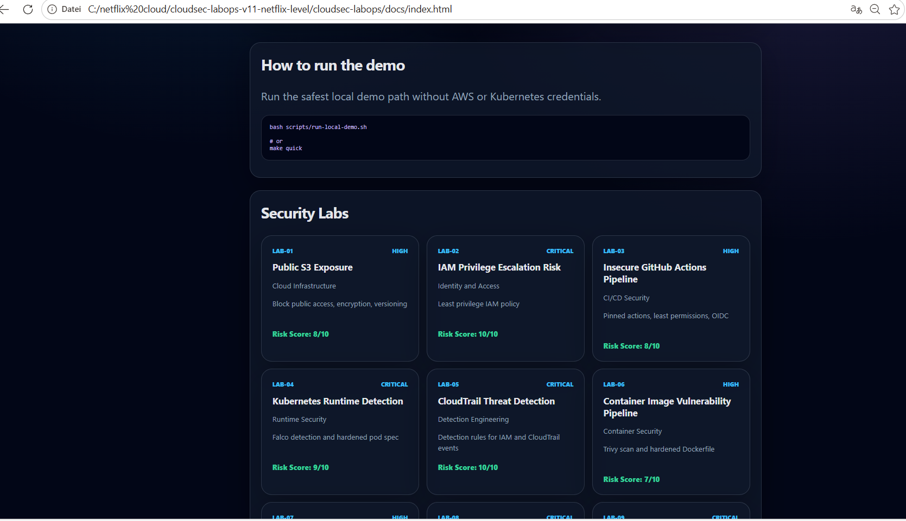
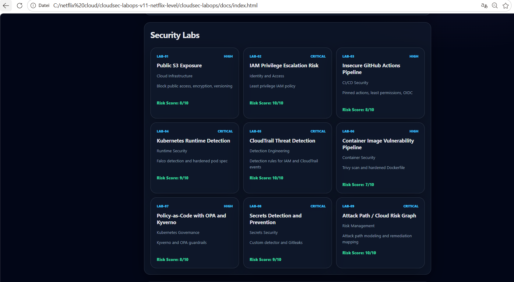
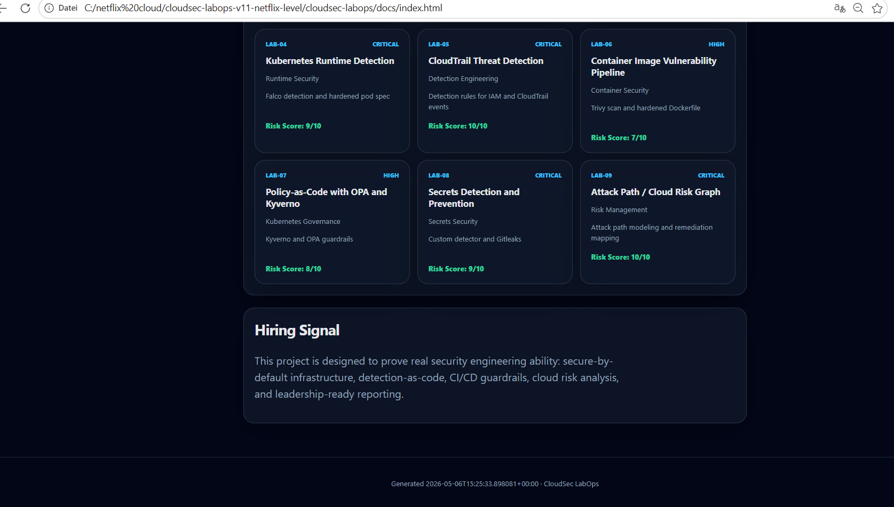
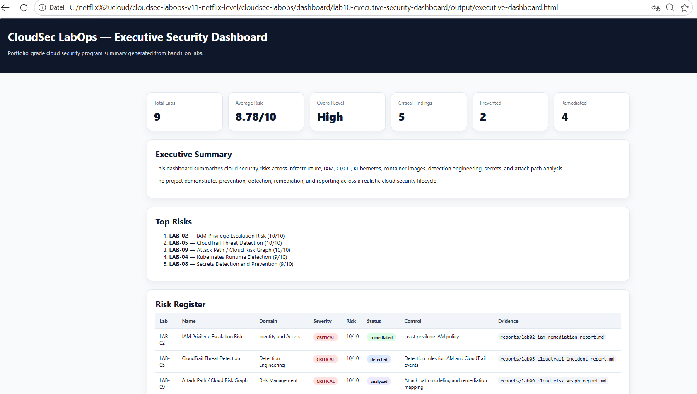
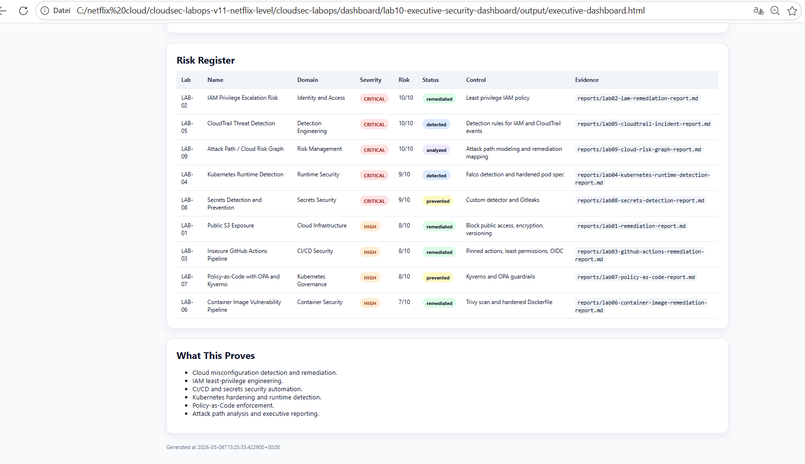
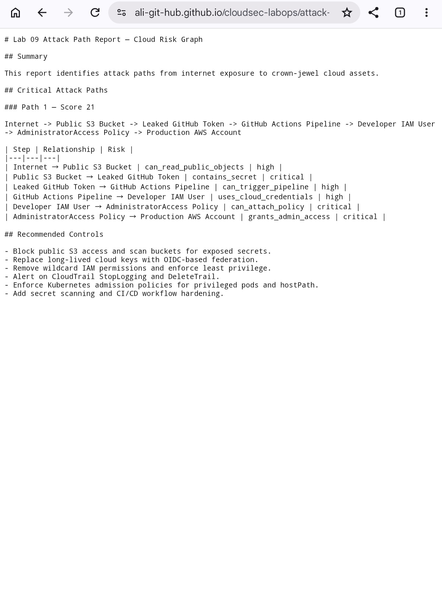

# CloudSec LabOps


**CloudSec LabOps** is a hands-on cloud security engineering portfolio project.

It demonstrates the full security lifecycle:

```txt
Attack simulation → Detection → Remediation → Prevention → Executive reporting
```

## Fast Demo

```bash
bash scripts/run-local-demo.sh
```

or:

```bash
make quick
```

Open:

```txt
docs/index.html
dashboard/lab10-executive-security-dashboard/output/executive-dashboard.html
```

## Project Overview

See:

```txt
PROJECT_OVERVIEW.md
```

---


A real hands-on Cloud Security project that demonstrates how to detect, block, and remediate cloud misconfigurations using Terraform, Checkov, Trivy, and GitHub Actions.

## Current Lab

### Lab 01 — Public S3 Exposure

This lab contains:

- A vulnerable Terraform configuration that creates an insecure S3 bucket.
- A secure Terraform configuration with public access blocked and encryption enabled.
- GitHub Actions pipeline that scans Terraform before merge.
- A remediation report written like a real security engineering deliverable.

## Tools

- Terraform
- AWS
- Checkov
- Trivy
- GitHub Actions

## Quick Start

```bash
cd terraform/lab01-public-s3/vulnerable
terraform init
terraform plan
```

Run security scan:

```bash
cd ../../..
bash scripts/scan-iac.sh
```

## Project Goal

Build a portfolio-grade Cloud Security Engineering project that proves practical ability, not just theory.

## Lab 02 — IAM Privilege Escalation Risk

This lab demonstrates how dangerous IAM wildcard permissions can lead to account compromise.

### Vulnerable version

```bash
cd terraform/lab02-iam-privilege-escalation/vulnerable
terraform init
terraform plan
```

### Secure version

```bash
cd terraform/lab02-iam-privilege-escalation/secure
terraform init
terraform plan
```

### Run IAM guardrail scan

```bash
bash scripts/detect-dangerous-iam.sh terraform
```

Expected result: the vulnerable lab should fail the scan because it contains dangerous IAM permissions.

## Lab 03 — Insecure GitHub Actions Pipeline

This lab demonstrates common CI/CD security problems and their secure alternatives.

### Vulnerable pipeline

```txt
cicd-security/lab03-insecure-github-actions/vulnerable/.github/workflows/deploy.yml
```

### Secure pipeline

```txt
cicd-security/lab03-insecure-github-actions/secure/.github/workflows/deploy.yml
```

### Run GitHub Actions guardrail scan

```bash
bash scripts/detect-dangerous-github-actions.sh ".github/workflows cicd-security"
```

Expected result: the vulnerable workflow should fail the scan because it contains dangerous CI/CD patterns.

## Lab 04 — Kubernetes Runtime Detection with Falco

This lab demonstrates Kubernetes runtime detection and workload hardening.

### Deploy vulnerable workload

```bash
bash scripts/k8s-lab04-deploy-vulnerable.sh
```

### Trigger suspicious behavior

```bash
kubectl exec -it -n cloudsec-labops-vulnerable vulnerable-shell-pod -- sh
kubectl exec -n cloudsec-labops-vulnerable vulnerable-shell-pod -- cat /host/etc/hostname
```

### Deploy secure workload

```bash
bash scripts/k8s-lab04-deploy-secure.sh
```

### Run Kubernetes manifest guardrail scan

```bash
bash scripts/k8s-manifest-security-scan.sh kubernetes
```

### Cleanup

```bash
bash scripts/k8s-lab04-cleanup.sh
```

## Lab 05 — CloudTrail Threat Detection

This lab demonstrates AWS detection engineering using CloudTrail-style events and detection-as-code rules.

### Run detection engine

```bash
python3 scripts/cloudtrail-detect.py \
  detections/lab05-cloudtrail-threat-detection/events/sample-cloudtrail.json \
  detections/lab05-cloudtrail-threat-detection/rules/cloudtrail-detections.yaml
```

### Output

```txt
detections/lab05-cloudtrail-threat-detection/output/findings.json
```

Expected result: the detector should flag IAM access key creation, AdministratorAccess attachment, and CloudTrail StopLogging.

## Lab 06 — Container Image Vulnerability Pipeline

This lab demonstrates secure container image builds and CI/CD scanning.

### Build and scan secure image

```bash
bash scripts/container-build-and-scan.sh cloudsec-labops-secure:latest
```

### Run Dockerfile guardrails

```bash
bash scripts/container-dockerfile-guardrail.sh containers
```

Expected result: vulnerable Dockerfile patterns should fail guardrails.

## Lab 07 — Policy-as-Code with OPA and Kyverno

This lab enforces Kubernetes security rules before deployment.

### Run guardrail

```bash
bash scripts/policy-as-code-guardrail.sh
```

### Optional Kyverno validation

```bash
kyverno apply policy-as-code/lab07-opa-kyverno/kyverno-policies \
  --resource policy-as-code/lab07-opa-kyverno/test-manifests/violating
```

Expected result: violating manifests should be blocked, passing manifests should succeed.

## Lab 08 — Secrets Detection and Prevention

This lab detects hardcoded credentials and demonstrates safe configuration design.

### Detect secrets in vulnerable examples

```bash
python3 scripts/secrets-detect.py secrets/lab08-secrets-detection/vulnerable
```

### Validate secure examples

```bash
python3 scripts/secrets-detect.py secrets/lab08-secrets-detection/secure
```

Expected result: vulnerable examples fail, secure examples pass.

## Lab 09 — Attack Path / Cloud Risk Graph

This lab builds an attack graph from cloud assets and finds critical paths to crown-jewel systems.

### Run attack graph analysis

```bash
python3 scripts/build-attack-graph.py attack-graph/lab09-cloud-risk-graph/data/cloud-assets.json
```

### Outputs

```txt
attack-graph/lab09-cloud-risk-graph/output/attack-paths.json
attack-graph/lab09-cloud-risk-graph/output/cloud-risk-graph.dot
attack-graph/lab09-cloud-risk-graph/output/attack-path-report.md
```

Expected result: the tool detects critical chained attack paths.

## Lab 10 — Executive Security Dashboard

This lab generates an executive dashboard from the project risk register.

### Generate dashboard

```bash
python3 scripts/generate-executive-dashboard.py \
  dashboard/lab10-executive-security-dashboard/data/risk-register.json
```

### Outputs

```txt
dashboard/lab10-executive-security-dashboard/output/executive-dashboard.html
dashboard/lab10-executive-security-dashboard/output/executive-summary.json
dashboard/lab10-executive-security-dashboard/output/executive-summary.md
```

Expected result: a browser-ready HTML dashboard and executive summary.

## Screenshots

### Homepage





### Executive Dashboard



### Attack Path Report


### GitHub Actions & Security

